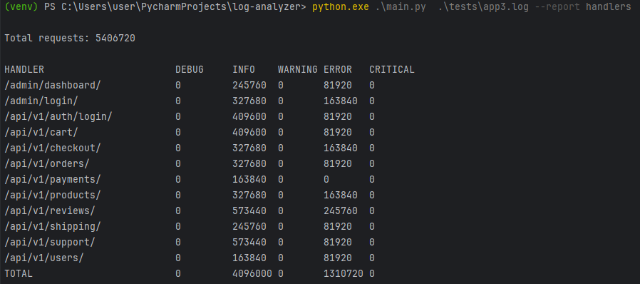

# Анализатор журналов логирования для Django

## Описание
Этот проект представляет собой командное приложение (CLI), предназначенное для анализа логов Django-приложений. Он позволяет генерировать отчёты по запросам к API-эндпоинтам, сортируя их по уровням логирования (DEBUG, INFO, WARNING, ERROR, CRITICAL). Программа поддерживает обработку нескольких лог-файлов и возможность добавления новых отчётов в будущем.

## Установка

1. Клонируйте репозиторий:
    ```bash
    git clone git@github.com:usershoislom/log-analyzer.git
    cd log-analyzer
    ```

2. Установите зависимости в виртуальном окружении:
    ```bash
    python3 -m venv venv
    source venv/bin/activate
    pip install -r requirements.txt
    ```

## Пример использования

Приложение позволяет генерировать отчёт по запросам к API-эндпоинтам. Пример использования:

```bash
python3 main.py <пути к логам> --report handlers
```


## Как добавить новый отчёт

Чтобы добавить новый отчёт, нужно выполнить несколько шагов:

###  Создать новый класс отчёта

В каталоге `reports/` создайте новый файл для вашего отчёта. Например, если вы хотите добавить отчёт, который будет анализировать статистику по ошибкам, создайте файл `reports/errors.py`.

```python
from reports.base import BaseReport, register_report

@register_report("errors")
class ErrorsReport(BaseReport):
    def process(self):
        # Реализуйте логику обработки логов
        pass

    def generate(self):
        # Реализуйте логику генерации отчёта
        self.print_summary()
```
### Методы отчёта

- **process**: Метод для обработки логов и сбора статистики. В этом методе вы должны анализировать лог-файлы, извлекать нужные данные и обновлять внутренние структуры отчёта. Можете воспользоваться методами extract_log_level, extract_endpoint.


- **generate**: Метод для генерации отчёта и его вывода. Здесь будет формироваться вывод в нужном формате (например, вывод в консоль print_summary).

###  Зарегистрировать новый отчёт

Каждый новый отчёт должен быть зарегистрирован в системе отчётов. Для этого используется декоратор `@register_report("имя_отчёта")`. Этот декоратор добавляет ваш отчёт в глобальный реестр отчётов `REPORT_TYPES`.

Пример регистрации отчёта:

```bash
@register_report("errors")
class ErrorsReport(BaseReport):
    # Логика отчёта
```

